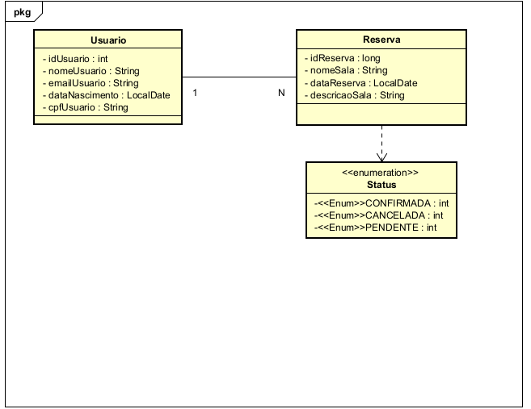

# *Projeto Revisão Java com Spring*

## 📌 Sobre o Projeto
Este projeto é uma revisão de Java com o framework Spring, contendo operações CRUD e validações essenciais.

 

## 🚀 Funcionalidades

## 👤 Classe Usuário

### 🔹 Métodos HTTP Implementados
- *GET*: Busca por idUsuario e cpfUsuario
- *POST*: Cadastro de novos usuário
- *PUT*: Atualização de dados do usuário
- *DELETE*: Remoção de usuário

### ✅ Validações Implementadas
- *CPF duplicado*: Impede a inserção de CPFs repetidos
- *Campos nulos*: Bloqueia requisições com valores ausentes
- *Campos vazios*: Garante que os dados obrigatórios sejam preenchidos
- *Deletar usário*: Se caso houver um usuário com uma reserva , você não consegue excluir o usário (sera necessario tira o usuário da reserva para que você consiga excluir ele ).

 ## 🏞 Classe Reserva

### 🔹 Métodos HTTP Implementados
- *GET*: Busca por idReserva e nomeSala
- *POST*: Cadastro de novos reserva
- *PUT*: Atualização de dados do reserva
- *DELETE*: Remoção de reserva

### ✅ Validações Implementadas
- *Nome da sala duplicado*: Impede a inserção de nome de sala repetidos
- *Campos nulos*: Bloqueia requisições com valores ausentes
- *Campos vazios*: Garante que os dados obrigatórios sejam preenchidos

### 🗄 Banco de Dados Suportados
- *H2* (banco em memória para testes)
- *PostgreSQL* (banco de produção)

### ⚠ Tratamento de Erros
- Retorno de mensagens amigáveis para o usuário
- Padronização de respostas HTTP para erros comuns

---
